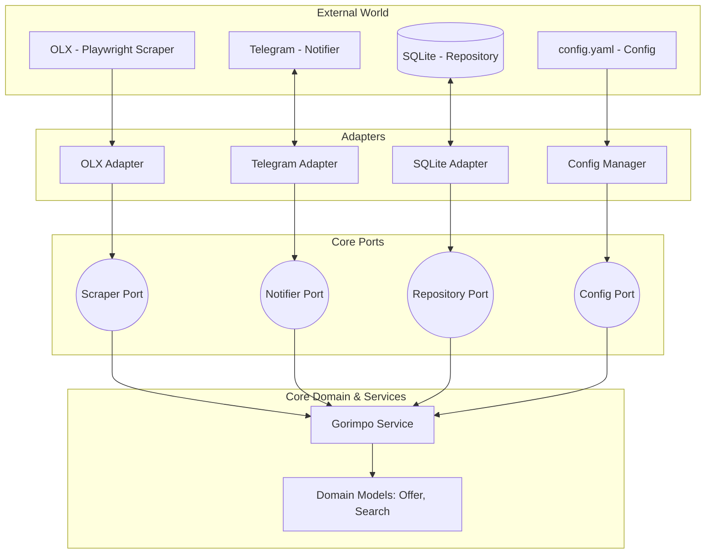

<div align="center">
  
  <h1>GOrimpo</h1>
  <p><strong>A resilient scraper for real-time marketplace monitoring</strong></p>

  ### 🇧🇷 For the README in Portuguese, click [here](./docs/README.pt.md)

  <p>
    
    
    
    
    
    
  </p>
</div>

## Table of Contents
1. [About](#about)
2. [Features](#features)
3. [Technology](#technology)
4. [How to Run](#how-to-run)
5. [Configuration](#configuration)
6. [Roadmap](#roadmap)

## About
GOrimpo is a continuous monitoring solution designed for the second-hand market and collectibles. It automates searches for specific terms, processes price and negative filters, and instantly notifies the user via Telegram.

Unlike simple scripts, GOrimpo was built with a focus on **resilience and stealth**, mimicking human behavior to avoid detection by anti-bot systems.

## Features
- **Multimodal Search:** Dynamic support for **Chromium, Firefox, and WebKit** rendering engines.
- **Stealth Identity Factory:** Random generation of thousands of real User-Agents at runtime.
- **Adaptive Circuit Breaker:** IP protection system that halts searches and scales cooldown time automatically upon detecting blocks (403 Forbidden).
- **Behavioral Mimicry:** Implementation of random delays (*jitter*) and behavioral micro-rests to break rhythmic search patterns.
- **Advanced Filtering:** Keyword exclusion system and detection of sponsored/featured ads that are irrelevant to the search.
- **Smart Notification:** Support for Telegram Topics to organize searches into different categories.

## Technology
The project is built with **Go v1.25.5**, uses **SQLite3** for data persistence, and **Playwright** for the scraping engine.

### Architecture
The project follows **Hexagonal Architecture (Ports & Adapters)**, ensuring that the application core (Domain and Services) is completely decoupled from external technologies like databases, scraping frameworks, or notification APIs.



## How to Run
The recommended way to run GOrimpo is through Docker, ensuring that all Playwright dependencies and browsers are isolated.

```bash
# Clone the repository
git clone https://github.com/LXSCA7/gorimpo.git

# Configure your environment variables (.env)
TELEGRAM_TOKEN=your_token
TELEGRAM_CHAT_ID=your_chat_id

# Start the container
docker-compose up -d
```

### Configuration
Search intelligence is entirely controlled via `config.yaml`. Example:

```yaml
app:
  default_notifier: "telegram"
  use_topics: true # define if telegram will use topics

categories: 
  - "🍄 nintendo"
  - "🎮 playstation"
  - "👾 handhelds"
  # add your category here, GOrimpo will automatically create the topic on Telegram

scraper:
  user_agent_count: 50 # Number of identities in the pool
  min_jitter: 2
  max_jitter: 10

searches:
  - term: "Nintendo 64"
    min_price: 200
    max_price: 600
    category: "nintendo"
    exclude: ["box", "manuals", "broken"]
```

## Roadmap
- [ ] Implementation of new adapters for Enjoei, MercadoLivre, and Shopee.
- [ ] Analytical frontend using **HTMX** and **Templ**.
- [ ] Price history implementation for market trend analysis.

<p align="center">
Developed by <a href="https://github.com/LXSCA7">LXSCA</a> ⭐️ <br>
</p>