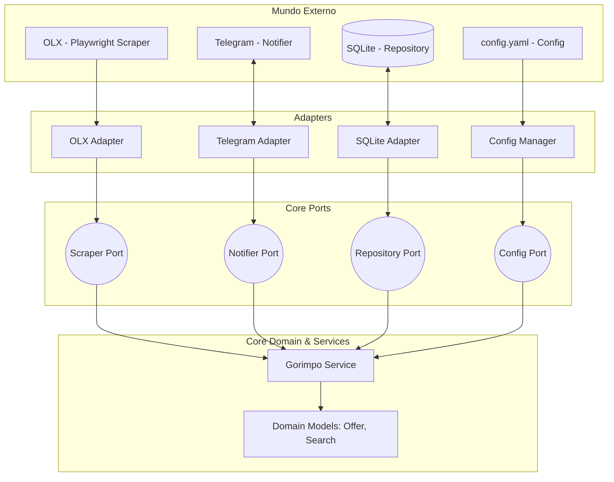

<div align="center">
  
  <h1>GOrimpo</h1>
  <p><strong>Um scraper resiliente para monitoramento de marketplaces em tempo real</strong></p>

  ### 🇬🇧🇺🇸 For the README in English, click [here](../README.md)

  <p>
    
    
    
    
    
    
    
  </p>
</div>

## Sumário
1. [Sobre](#sobre)
2. [Funcionalidades](#funcionalidades)
3. [Tecnologia](#tecnologia)
4. [Como rodar](#como-rodar)
5. [Configurações](#configurações)
6. [Roadmap](#roadmap)

## Sobre
O GOrimpo é uma solução de monitoramento contínuo para o mercado de itens usados e raridades. Ele automatiza a busca por termos específicos, processa filtros de preço e termos negativos, e notifica o usuário instantaneamente via Telegram. 

Diferente de scripts simples, o GOrimpo foi construído com foco em resiliência e stealth, mimetizando o comportamento humano para evitar detecções de sistemas anti-bot.

## Funcionalidades
- Busca Multimodal: Suporte dinâmico aos motores de renderização Chromium, Firefox e WebKit.
- Stealth Identity Factory: Geração aleatória de milhares de User-Agents reais em tempo de execução.
- Adaptive Circuit Breaker: Sistema de proteção de IP que interrompe as buscas e escala o tempo de repouso automaticamente ao detectar bloqueios.
- Behavioral Mimicry: Implementação de atrasos randômicos (jitter) e micro-respiros comportamentais para quebrar padrões rítmicos de busca.
- Filtragem Avançada: Sistema de exclusão por palavras-chave no título e detecção de anúncios patrocinados/destaques irrelevantes.
- Notificação Inteligente: Suporte a tópicos do Telegram para organizar buscas em diferentes categorias.

## Tecnologia

O projeto é feito em go v1.25.5, utiliza SQLite3 para armazenamento de dados e playwright para o scraper da OLX 

### Arquitetura

O projeto utiliza Arquitetura Hexagonal (Ports & Adapters), garantindo que o núcleo da aplicação (Domain e Services) seja totalmente desacoplado de tecnologias externas como bancos de dados, frameworks de scraping ou APIs de notificação.



## Como rodar
A forma recomendada de execução é através do Docker, garantindo que todas as dependências do Playwright e seus navegadores estejam isoladas.

```bash
# Clone o repositório
git clone https://github.com/LXSCA7/gorimpo.git

# Configure suas variáveis de ambiente (.env)
TELEGRAM_TOKEN=seu_token
TELEGRAM_CHAT_ID=seu_id
GOTIFY_HOST=your_host
GOTIFY_TOKEN=seu_token_gotify

docker-compose up -d
```

### Configurações

Toda a inteligência de busca é controlada via `config.yaml`. Exemplo:

```yaml
app:
  default_notifier: "telegram" # opções: gotify, telegram
  notifiers:
    telegram:
      use_topics: true # define se o telegram vai utilizar topicos

categories: 
  - "🍄 nintendo"
  - "🎮 playstation"
  - "👾 portateis"
   # adicione sua categoria aqui, o GOrimpo cria automaticamente no telegram

scraper:
  user_agent_count: 50 # Quantidade de identidades no pool
  min_jitter: 2
  max_jitter: 10

searches:
  - term: "Nintendo 64"
    min_price: 200
    max_price: 600
    category: "games"
    exclude: ["caixa", "manuais", "defeito"]
```

## Roadmap
- [ ] Implementação de novos adaptadores para Enjoei, MercadoLivre e Shopee.

- [ ] Frontend para visualização analítica utilizando HTMX e Templ.

- [ ] Implementação de histórico de preços para análise de tendência de mercado.
<p align="center">
Desenvolvido por <a href="https://github.com/LXSCA7">LXSCA</a> ⭐️ <br>
</p>